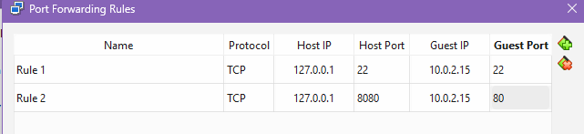
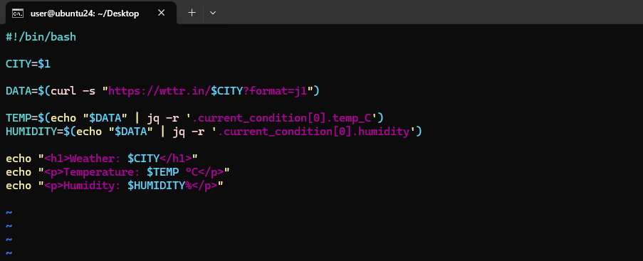
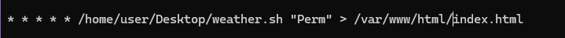
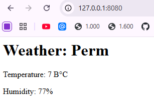

# 2

- \
  *Проброс порта с хостовой системы в гостевую.*

&nbsp;

- 
- \
  *Код баш скрипта. Делаем код исполняемым.*

&nbsp;

- \
  *Настройка крона чтобы скрипт запусказлся каждую минуту*

&nbsp;

- \
  *Проверка в браузере*